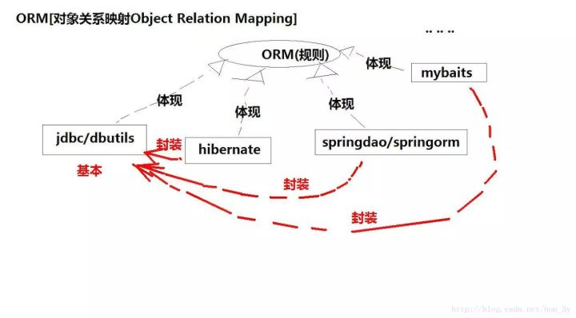

# 一、什么是MyBatis
    MyBatis是一个基于Java的持久层框架，它支持自定义SQL、存储过程以及高级映射。MyBatis是ORM的一种实现框架，是对JDBC的一种封装。  
    MyBatis免除了几乎所有的JDBC代码以及设置参数和获取结果集的参数。
   

# 二、MyBatis主要内容
## SqlSessionFactory、SqlSessionFactoryBuilder  
    每个基于MyBatis的应用都是以一个SqlSessionFactory的实例为核心的。SqlSessionFactory的实例可以通过SqlSessionFactoryBuilder获得。  
    而SqlSessionFactoryBuilder则可以从XML配置文件或一个预先配置的Configuration实例来构建出SqlSessionFactory实例。
  
    
