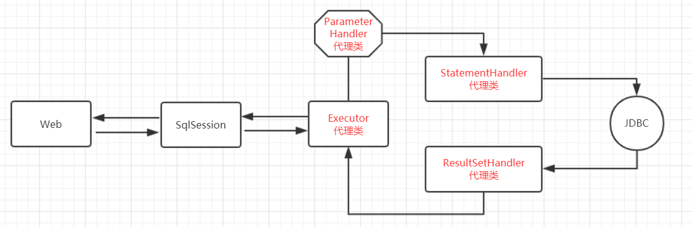

# 一、MyBatis插件介绍
        MyBatis允许用户在已樱色语句执行过程中的某一点进行拦截调用。MyBatis使用插件来拦截方法的调用。默认情况下，MyBatis插件允许使用插件来拦截的对象包括以下四种：
>> - Executor
>> - ParameterHandler
>> - ResultSetHandler
>> - StatementHandler

        MyBatis可以对这四个接口中所有的方法进行拦截；

# 二、MyBatis插件（代理类）示意图


# 三、MyBatis自定义插件的实现
        通过MyBatis提供的强大机制，使用插件是非常简单的，只需实现Interceptor接口，并制定想要拦截的方法签名即可。
        Interceptor接口的定义如下：
        
```
public interface Interceptor {
  //拦截器具体实现
  Object intercept(Invocation invocation) throws Throwable;
  //拦截器的代理类
  Object plugin(Object target);
  //添加属性
  void setProperties(Properties properties);
}
```